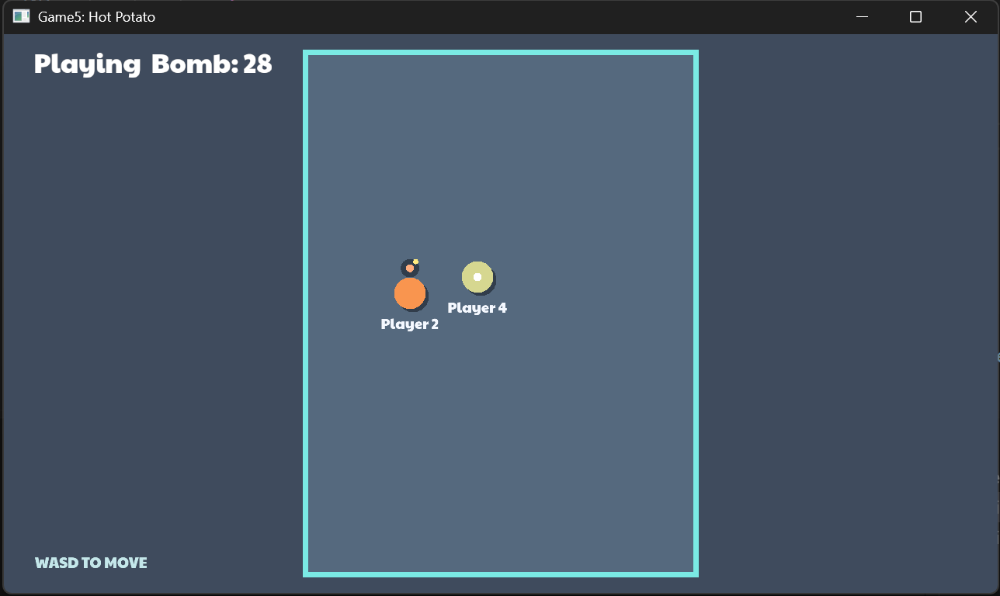

# Hot Potato

Author: Lee(jiaweil8)

Design: This is a multiplayer hot potato game where players collide to pass a timed bomb. Players can wrap around all four sides of the arena to chase or escape from each other.

Networking: In Game.hpp and Game.cpp, I added the bomb holder, bomb timer, round state, and losing player to the server game state and the state message. The server updates the timer and bomb transfers, and PlayMode.cpp receives and displays the same state on every client.

Screen Shot:

How To Play:

WASD to move; Bump into other player to get rid of the bomb; 

Sources: Google font Paytone https://fonts.google.com/specimen/Paytone+One

This game was built with [NEST](NEST.md).

